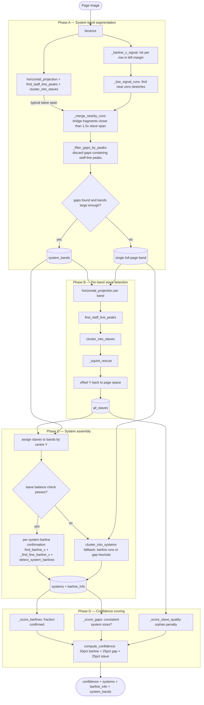

```mermaid
flowchart TD
    A([Page image]) --> B[binarize]

    subgraph PHASE_A [Phase A — System band segmentation]
        B --> A1[_barline_v_signal: ink per row in left margin]
        B --> A0[horizontal_projection + find_staff_line_peaks + cluster_into_staves]
        A0 -->|typical stave span| A2b
        A1 --> A2[_low_signal_runs: find near-zero stretches]
        A2 --> A2b[_merge_nearby_runs: bridge fragments closer than 1.5x stave span]
        A2b --> A3[_filter_gaps_by_peaks: discard gaps containing staff-line peaks]
        A3 --> A4{gaps found and bands large enough?}
        A4 -- yes --> A5[(system_bands)]
        A4 -- no --> A6[(single full-page band)]
    end

    subgraph PHASE_B [Phase B — Per-band stave detection]
        A5 --> B1[horizontal_projection per band]
        A6 --> B1
        B1 --> B2[find_staff_line_peaks]
        B2 --> B3[cluster_into_staves]
        B3 --> B4[_squint_rescue]
        B4 --> B5[offset Y back to page space]
        B5 --> B6[(all_staves)]
    end

    subgraph PHASE_C [Phase C — System assembly]
        B6 --> C1[assign staves to bands by centre Y]
        A5 --> C1
        C1 --> C2{stave balance check passes?}
        C2 -- yes --> C3[per-system barline confirmation: find_barline_x + _find_fine_barline_x + detect_system_barlines]
        C3 --> C4[(systems + barline_info)]
        C2 -- no --> C5[cluster_into_systems fallback: barline runs or gap heuristic]
        A6 --> C5
        C5 --> C4
    end

    subgraph CONFIDENCE [Phase D — Confidence scoring]
        C4 --> D1[_score_barlines: fraction confirmed]
        C4 --> D2[_score_gaps: consistent system sizes?]
        B6 --> D3[_score_stave_quality: orphan penalty]
        D1 --> D4[compute_confidence: 50pct barline + 25pct gap + 25pct stave]
        D2 --> D4
        D3 --> D4
    end

    D4 --> E([confidence + systems + barline_info + system_bands])
```
