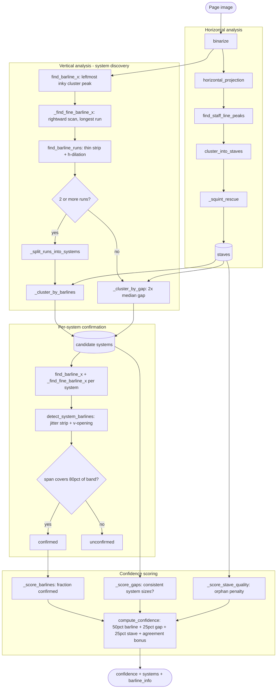

```mermaid
flowchart TD
    A([Page image]) --> B[binarize]

    subgraph HORIZONTAL [Horizontal analysis]
        B --> C[horizontal_projection]
        C --> D[find_staff_line_peaks]
        D --> E[cluster_into_staves]
        E --> F[_squint_rescue]
        F --> G[(staves)]
    end

    subgraph VERTICAL [Vertical analysis - system discovery]
        B --> H[find_barline_x: leftmost inky cluster peak]
        H --> I[_find_fine_barline_x: rightward scan, longest run]
        I --> J[find_barline_runs: thin strip + h-dilation]
        J --> K{2 or more runs?}
        K -- yes --> L[_split_runs_into_systems]
        L --> M[_cluster_by_barlines]
        K -- no --> N[_cluster_by_gap: 2x median gap]
        G --> M
        G --> N
    end

    M --> O[(candidate systems)]
    N --> O

    subgraph CONFIRMATION [Per-system confirmation]
        O --> P[find_barline_x + _find_fine_barline_x per system]
        P --> Q[detect_system_barlines: jitter strip + v-opening]
        Q --> R{span covers 80pct of band?}
        R -- yes --> S[confirmed]
        R -- no --> T[unconfirmed]
    end

    subgraph CONFIDENCE [Confidence scoring]
        S --> U[_score_barlines: fraction confirmed]
        O --> V[_score_gaps: consistent system sizes?]
        G --> W[_score_stave_quality: orphan penalty]
        U --> X[compute_confidence: 50pct barline + 25pct gap + 25pct stave + agreement bonus]
        V --> X
        W --> X
    end

    X --> Y([confidence + systems + barline_info])
```
